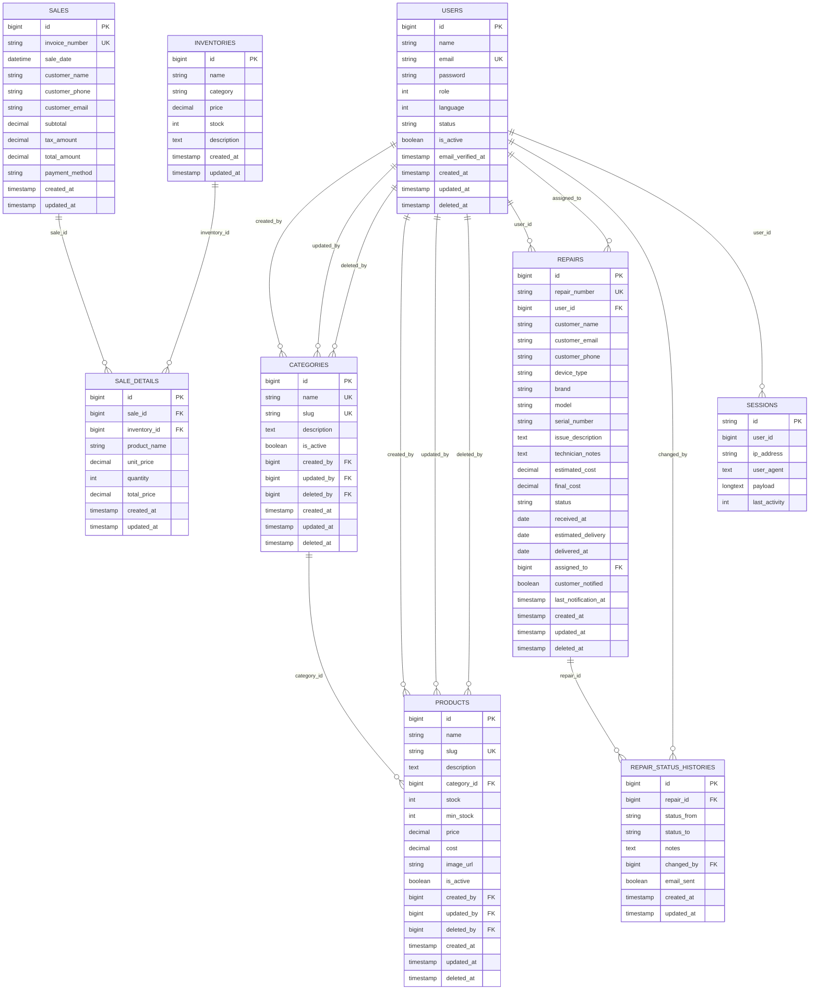

# Diagrama Entidad-Relación

## 1. Objetivo

Este documento describe la estructura actual de la base de datos de **AriaTechShop-ERP**, identificando las principales entidades, sus campos relevantes y las relaciones existentes entre ellas.

La información se obtuvo mediante el análisis de las migraciones y modelos presentes en el repositorio. El diagrama representa únicamente las relaciones identificadas en el estado actual del proyecto.

---

## 2. Entidades principales

### 2.1 Users

La tabla `users` almacena los usuarios del sistema.

**Clave primaria:**

* `id`

**Campos principales:**

* `name`
* `email`
* `password`
* `role`
* `language`
* `status`
* `is_active`
* `email_verified_at`
* `remember_token`
* `created_at`
* `updated_at`
* `deleted_at`

La tabla utiliza `SoftDeletes`.

Los usuarios mantienen relaciones con productos, categorías, reparaciones, historial de reparaciones y sesiones.

---

### 2.2 Categories

La tabla `categories` almacena las categorías utilizadas para clasificar productos.

**Clave primaria:**

* `id`

**Campos principales:**

* `name`
* `slug`
* `description`
* `is_active`
* `created_by`
* `updated_by`
* `deleted_by`
* `created_at`
* `updated_at`
* `deleted_at`

La tabla utiliza `SoftDeletes`.

Los campos `created_by`, `updated_by` y `deleted_by` se relacionan con `users.id`.

---

### 2.3 Products

La tabla `products` representa el catálogo formal de productos.

**Clave primaria:**

* `id`

**Campos principales:**

* `name`
* `slug`
* `description`
* `category_id`
* `stock`
* `min_stock`
* `price`
* `cost`
* `image_url`
* `is_active`
* `created_by`
* `updated_by`
* `deleted_by`
* `created_at`
* `updated_at`
* `deleted_at`

La tabla utiliza `SoftDeletes`.

### Relaciones

* `category_id` → `categories.id`
* `created_by` → `users.id`
* `updated_by` → `users.id`
* `deleted_by` → `users.id`

La relación con `categories` es opcional, ya que `category_id` permite valores nulos.

---

### 2.4 Inventories

La tabla `inventories` almacena información de elementos disponibles en inventario.

**Clave primaria:**

* `id`

**Campos principales:**

* `name`
* `category`
* `price`
* `stock`
* `description`
* `created_at`
* `updated_at`

Actualmente no posee claves foráneas hacia `products`, `categories` o `users`.

El campo `category` es un texto y no una clave foránea hacia la tabla `categories`.

---

### 2.5 Sales

La tabla `sales` almacena las transacciones de venta.

**Clave primaria:**

* `id`

**Campos principales:**

* `invoice_number`
* `sale_date`
* `customer_name`
* `customer_phone`
* `customer_email`
* `subtotal`
* `tax_amount`
* `total_amount`
* `payment_method`
* `created_at`
* `updated_at`

Actualmente no existe una clave foránea directa entre `sales` y `users`.

Los datos del cliente se almacenan directamente mediante campos de texto.

---

### 2.6 Sale Details

La tabla `sale_details` almacena las líneas o productos incluidos en una venta.

**Clave primaria:**

* `id`

**Campos principales:**

* `sale_id`
* `inventory_id`
* `product_name`
* `unit_price`
* `quantity`
* `total_price`
* `created_at`
* `updated_at`

### Relaciones

* `sale_id` → `sales.id`
* `inventory_id` → `inventories.id`

La eliminación de una venta elimina sus detalles mediante `cascade`.

La eliminación de un registro de inventario está restringida cuando existen detalles de venta asociados.

---

### 2.7 Repairs

La tabla `repairs` almacena las solicitudes de reparación.

**Clave primaria:**

* `id`

**Campos principales:**

* `repair_number`
* `user_id`
* `customer_name`
* `customer_email`
* `customer_phone`
* `device_type`
* `brand`
* `model`
* `serial_number`
* `issue_description`
* `technician_notes`
* `estimated_cost`
* `final_cost`
* `status`
* `received_at`
* `estimated_delivery`
* `delivered_at`
* `assigned_to`
* `customer_notified`
* `last_notification_at`
* `created_at`
* `updated_at`
* `deleted_at`

La tabla utiliza `SoftDeletes`.

### Relaciones

* `user_id` → `users.id`
* `assigned_to` → `users.id`

Ambas relaciones permiten valores nulos y utilizan `nullOnDelete`.

Los estados definidos actualmente son:

* `pending`
* `diagnosed`
* `approved`
* `in_progress`
* `completed`
* `delivered`
* `cancelled`

---

### 2.8 Repair Status Histories

La tabla `repair_status_histories` almacena el historial de cambios de estado de las reparaciones.

**Clave primaria:**

* `id`

**Campos principales:**

* `repair_id`
* `status_from`
* `status_to`
* `notes`
* `changed_by`
* `email_sent`
* `created_at`
* `updated_at`

### Relaciones

* `repair_id` → `repairs.id`
* `changed_by` → `users.id`

Cuando se elimina una reparación, sus registros de historial se eliminan mediante `cascade`.

Cuando se elimina el usuario relacionado con `changed_by`, el campo puede establecerse en `NULL`.

---

## 3. Relaciones entre entidades

Las relaciones principales identificadas son:

| Entidad origen            | Campo          | Entidad destino  | Cardinalidad | Eliminación |
| ------------------------- | -------------- | ---------------- | ------------ | ----------- |
| `products`                | `category_id`  | `categories.id`  | N:1          | `set null`  |
| `products`                | `created_by`   | `users.id`       | N:1          | `null`      |
| `products`                | `updated_by`   | `users.id`       | N:1          | `null`      |
| `products`                | `deleted_by`   | `users.id`       | N:1          | `null`      |
| `categories`              | `created_by`   | `users.id`       | N:1          | `null`      |
| `categories`              | `updated_by`   | `users.id`       | N:1          | `null`      |
| `categories`              | `deleted_by`   | `users.id`       | N:1          | `null`      |
| `sale_details`            | `sale_id`      | `sales.id`       | N:1          | `cascade`   |
| `sale_details`            | `inventory_id` | `inventories.id` | N:1          | `restrict`  |
| `repairs`                 | `user_id`      | `users.id`       | N:1          | `null`      |
| `repairs`                 | `assigned_to`  | `users.id`       | N:1          | `null`      |
| `repair_status_histories` | `repair_id`    | `repairs.id`     | N:1          | `cascade`   |
| `repair_status_histories` | `changed_by`   | `users.id`       | N:1          | `null`      |

---

## 4. Relaciones de usuarios

La tabla `users` funciona como una de las entidades centrales del modelo actual.

Se relaciona con:

### Products

Mediante:

* `created_by`
* `updated_by`
* `deleted_by`

Estas relaciones permiten identificar al usuario asociado con las operaciones realizadas sobre un producto.

### Categories

Mediante:

* `created_by`
* `updated_by`
* `deleted_by`

### Repairs

Mediante dos relaciones diferentes:

* `user_id`: usuario asociado como cliente de la reparación.
* `assigned_to`: usuario asignado como técnico.

### Repair Status Histories

Mediante:

* `changed_by`: usuario que realizó el cambio de estado.

### Sessions

Mediante:

* `sessions.user_id`

Esta relación permite asociar sesiones con usuarios.

---

## 5. Relaciones de ventas

El flujo de datos de ventas se estructura de la siguiente manera:

```text
sales
   │
   │ 1:N
   ▼
sale_details
   │
   │ N:1
   ▼
inventories
```

Una venta puede contener múltiples registros en `sale_details`.

Cada detalle de venta referencia un registro de `inventories` mediante `inventory_id`.

Actualmente:

* `sales` no tiene `user_id`.
* `sale_details` no referencia directamente a `products`.
* `sale_details` referencia a `inventories`.
* `inventories` no tiene una relación formal con `products`.

Por lo tanto, el modelo actual mantiene separadas las estructuras `products` e `inventories`.

---

## 6. Relaciones de reparaciones

El flujo de reparaciones se estructura de la siguiente manera:

```text
users
 │
 │ 1:N
 ▼
repairs
 │
 │ 1:N
 ▼
repair_status_histories
 │
 │ N:1
 ▼
users
```

Una reparación puede estar asociada con:

* Un usuario como cliente mediante `user_id`.
* Un usuario como técnico mediante `assigned_to`.

Una reparación puede tener múltiples registros de historial en `repair_status_histories`.

Cada registro del historial puede identificar al usuario que realizó el cambio mediante `changed_by`.

---

## 7. Tablas de infraestructura

Además de las entidades principales del negocio, el proyecto contiene tablas utilizadas por Laravel y Sanctum.

### sessions

Utilizada para almacenar las sesiones de la aplicación.

Cuenta con el campo `user_id`, utilizado para identificar al usuario asociado con una sesión.

### password_reset_tokens

Utilizada para almacenar información relacionada con tokens para recuperación de contraseña.

No tiene claves foráneas.

### personal_access_tokens

Utilizada por Laravel Sanctum para almacenar tokens de acceso a la API.

Utiliza una relación polimórfica mediante:

* `tokenable_type`
* `tokenable_id`

No existe una clave foránea tradicional hacia `users`.

La relación permite que el token pueda asociarse estructuralmente con diferentes modelos.

### cache

Utilizada para almacenar información de caché.

### cache_locks

Utilizada para administrar bloqueos asociados con el sistema de caché.

### jobs

Utilizada para almacenar trabajos pendientes de la cola de Laravel.

### job_batches

Utilizada para administrar lotes de trabajos.

### failed_jobs

Utilizada para almacenar información sobre trabajos que no pudieron ejecutarse correctamente.

Estas tablas forman parte principalmente de la infraestructura del framework y no representan entidades principales del dominio del sistema.

---

## 8. Consideraciones del modelo actual

### 8.1 Products e Inventories

Actualmente existen dos estructuras independientes relacionadas con productos:

* `products`
* `inventories`

No existe una clave foránea entre ambas.

Además, `sale_details` utiliza `inventory_id`, mientras que no existe una relación directa entre `sale_details` y `products`.

Esto representa una característica importante del modelo actual que deberá considerarse en etapas posteriores de análisis y definición de requisitos.

---

### 8.2 Inventories y Categories

El campo `inventories.category` almacena la categoría como texto.

No existe una clave foránea hacia `categories.id`.

Por lo tanto, no existe una relación formal entre estas dos tablas.

---

### 8.3 Sales y Users

La tabla `sales` no contiene actualmente un `user_id`.

Los datos del cliente se almacenan mediante:

* `customer_name`
* `customer_email`
* `customer_phone`

Por lo tanto, no existe una relación directa entre una venta y un registro de `users`.

---

### 8.4 Personal Access Tokens

La tabla `personal_access_tokens` utiliza una relación polimórfica mediante `tokenable_type` y `tokenable_id`.

Por esta razón, no debe interpretarse como una clave foránea tradicional hacia `users`.

---

### 8.5 Soft Deletes

Las tablas:

* `users`
* `products`
* `categories`
* `repairs`

utilizan `SoftDeletes`.

Esto significa que los registros pueden conservarse en la base de datos utilizando el campo `deleted_at`, en lugar de eliminarse físicamente de forma inmediata.

---

## 9. Diagrama ER

El siguiente diagrama representa las relaciones identificadas en el estado actual del proyecto.



### Nota sobre `personal_access_tokens`

`personal_access_tokens` no se incluye como una relación directa con `users` dentro del diagrama principal debido a que utiliza una relación polimórfica mediante `tokenable_type` y `tokenable_id`.

Su relación no corresponde a una clave foránea tradicional y, por lo tanto, se documenta de manera independiente en la sección de infraestructura.

---

## 10. Conclusión

El modelo actual de la base de datos contiene ocho entidades principales relacionadas con el funcionamiento del sistema: usuarios, categorías, productos, inventario, ventas, detalles de venta, reparaciones e historial de reparaciones.

Las relaciones más importantes se encuentran en:

* Clasificación de productos mediante `categories`.
* Auditoría de productos y categorías mediante `users`.
* Relación entre ventas y sus detalles.
* Relación entre detalles de venta e inventario.
* Gestión de reparaciones y su historial.
* Asociación de usuarios con clientes, técnicos y acciones realizadas.

También se identificaron estructuras independientes, principalmente `products` e `inventories`, así como la ausencia de una relación directa entre `sales` y `users`.

Estas características representan el estado actual del modelo y servirán como referencia para las siguientes etapas de documentación, especificación y desarrollo.
